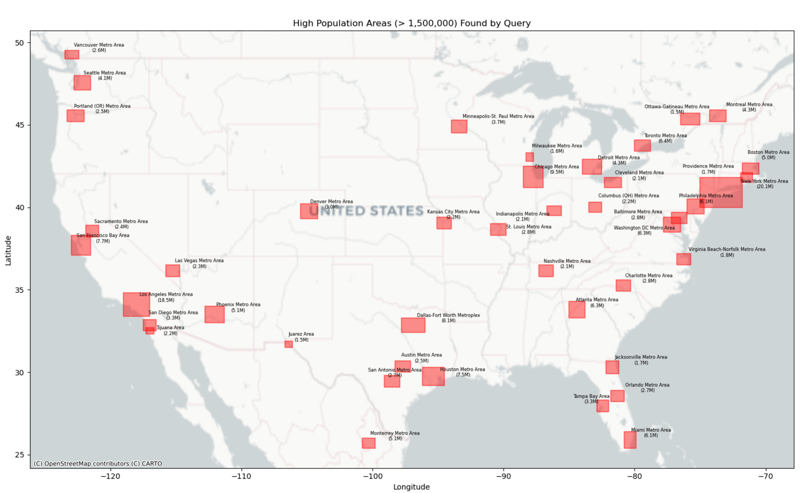
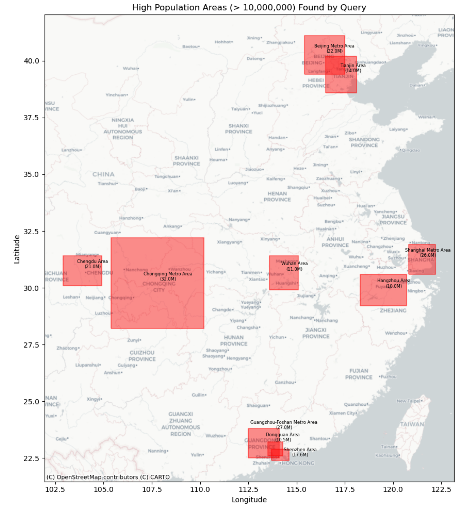
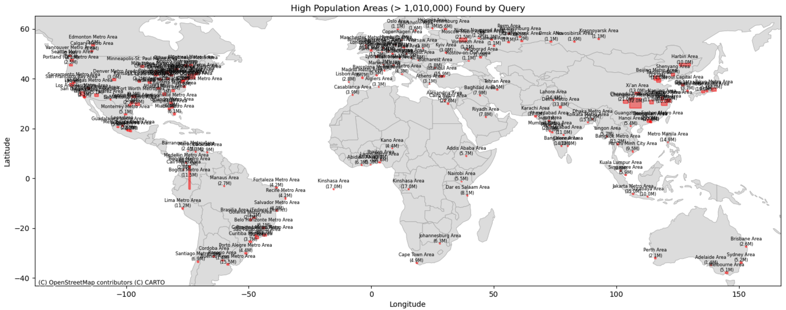

# R-Tree Spatial Query and Visualization Project

## Description

This project implements a basic 2D R-Tree data structure in C++ for efficient spatial querying. It loads geographic data (bounding boxes with associated names and populations) from a CSV file, allows users to query for areas within a specified country (or bounding box) that meet a minimum population threshold (1,000,000) for the current working version, and outputs the results to another CSV file.

A companion Python script is provided to read the output CSV and generate a map visualization of the query results, including labels and country context.

## What is an R-Tree?

("Rectangle Tree") is a tree-based data structure used for indexing multi-dimensional information, primarily spatial data like geographical coordinates, rectangles, or polygons. Key characteristics include:

* **Hierarchical Structure:** Similar to B-Trees, but designed for spatial data.
* **Minimum Bounding Rectangles (MBRs):** Each node in the tree represents the smallest rectangle (MBR) that encloses all the data points or child node MBRs contained within it.
* **Spatial Indexing:** Organizes spatial objects based on their location and extent.
* **Efficient Queries:** Allows for fast searching of spatial data, such as finding all objects that intersect with or are contained within a given query rectangle (window queries) or finding objects near a specific point (nearest neighbor queries). Leaf nodes contain pointers to the actual data objects (or the data itself), while internal nodes contain pointers to child nodes.


## Visuals

* **United States:**


* **China:**


* **World:**


## Features

* **C++ R-Tree Implementation:** A simple R-Tree using Minimum Bounding Rectangles (MBRs) supporting insertion and spatial intersection queries.
* **CSV Data Loading:** The C++ application loads initial spatial data from `input_data.csv`.
* **Country-Based Querying:** Allows users to specify a country name (for predefined countries) or enter manual bounding box coordinates.
* **Population Filtering:** Queries can filter results based on a minimum population threshold.
* **CSV Output:** Query results are written to `results.csv`.
* **Python Map Visualization:** A script (`visualize_results.py`) uses GeoPandas, Matplotlib, and Contextily to plot the results from `results.csv` onto a map, with auto-adjusting labels.

## Files Included

* `rtree.h`: C++ Header file defining the R-Tree structures and classes.
* `rtree.cpp`: C++ Implementation file for the R-Tree methods.
* `main.cpp`: C++ Main application file for loading data, handling user queries, and writing results.
* `input_data.csv`: Sample input data file containing geographic areas, populations, and bounding boxes. **(You need to create/populate this file)**
* `visualize_results.py`: Python script for visualizing the query results.
* `results.csv`: Output file generated by the C++ application containing query results. (Generated on run)
* `population_map_adjusted_labels_lines.png`: Example output map image generated by the Python script. (Generated on run)
* `README.md`: This file.
* `.gitignore`: Specifies files for Git to ignore.

## Prerequisites

1.  **C++ Compiler:** A modern C++ compiler supporting C++17 (e.g., g++, clang++).
2.  **Python:** Python 3.x installed.
3.  **Python Libraries:**
    * pandas
    * geopandas
    * matplotlib
    * contextily
    * shapely
    * adjustText
    Install using pip:
    ```bash
    pip install pandas geopandas matplotlib contextily shapely adjustText
    ```
    (Or use `pip3`. If GeoPandas installation fails, consider using Conda: `conda install -c conda-forge geopandas`)

## How to Compile the C++ Application

Navigate to the project directory in your terminal and run:

```bash
g++ main.cpp rtree.cpp -o query_app -std=c++17 -Wall -Wextra -O2
```
```bash
./query_app  
```

* **Input the country:**

    * Example: World or United States

    * Then input 1000000

```bash
python visualize_results.py 
```

* **Then you should get a map and just open it:**
